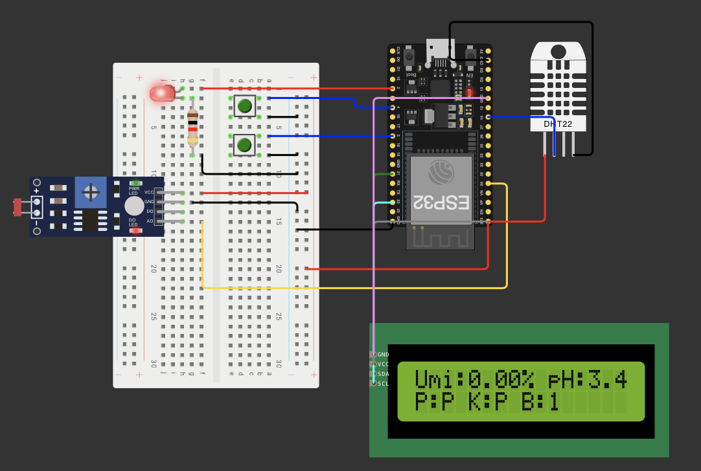
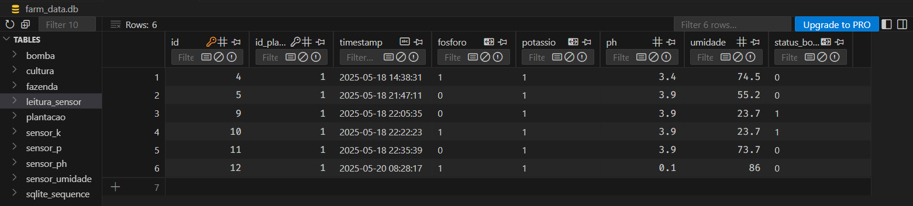

# FIAP - Faculdade de Informática e Administração Paulista

<p align="center">
  <a href="https://www.fiap.com.br/">
    
  </a>
</p>

## 👥 Grupo 21


## 👨‍🎓 Integrantes:

- Amanda Vieira Pires (RM565045)
- Ana Gabriela Soares Santos (RM565235)
- Bianca Nascimento de Santa Cruz Oliveira (RM561390)
- Milena Pereira dos Santos Silva (RM565464)
- Nayana Mehta Miazaki (RM565045)

## 👩‍🏫 Professores:

### Tutor(a)

- Lucas Gomes Moreira

### Coordenador(a)

- André Godoi

---

# 🌿 Sistema de Irrigação Inteligente com ESP32

### 🎥 Assista à demonstração no YouTube

[](https://youtu.be/kO4M81SsNnA)


## 📘 Descrição Geral

Este projeto faz parte de uma solução integrada de **irrigação inteligente com ESP32**, desenvolvida como atividade prática no curso de Inteligência Artificial da FIAP. Seu principal objetivo é aplicar conceitos de **automação agrícola**, **monitoramento ambiental**, **programação embarcada** e **persistência de dados**, simulando um cenário real de controle e otimização do uso da água em plantações.

A atividade foi dividida em duas frentes complementares:

1. **Entrega 1 — Monitoramento físico e lógica de irrigação com ESP32**  
   Foco na criação do sistema físico (simulado via Wokwi), que coleta dados do solo e aciona a irrigação automaticamente quando necessário.

2. **Entrega 2 — Armazenamento, CRUD e API climática e Dashboard em Python**  
   Foco na manipulação dos dados coletados, integração com uma API pública de clima e visualização gráfica dos dados.

<br>

## 🎯 Objetivo Geral

Construir uma solução digital de irrigação que seja:

- Sensível às condições reais do solo e clima
- Capaz de tomar decisões autônomas sobre irrigação
- Preparada para armazenar e visualizar dados históricos
- Inteligente o suficiente para considerar informações externas (como previsão de chuva) e fazer recomendações
- Fácil de interpretar visualmente através de um dashboard interativo

<br>

## 🔧 Entrega 1 — Monitoramento Físico e Lógica de Controle com ESP32

Esta etapa foca na construção de um sistema físico/simulado de irrigação baseado em sensores e lógica embarcada com ESP32, utilizando a IDE VS Code, PlatformIO e a extensão do Wokwi.

### Variáveis monitoradas:

| Variável             | Simulação/Componente                        |
| -------------------- | ------------------------------------------- |
| Umidade do solo      | Sensor DHT22                                |
| pH do solo           | Sensor LDR (com conversão para escala 0–14) |
| Presença de fósforo  | Botão com `INPUT_PULLUP`                    |
| Presença de potássio | Botão com `INPUT_PULLUP`                    |
| Bomba de irrigação   | LED (simula relé e bomba d’água)            |

### Lógica implementada:

- A bomba de irrigação é acionada **somente quando a umidade do solo está abaixo de 40%**.
- A leitura do pH é feita com um LDR analógico e normalizada para a escala 0 a 14 apenas para exibição informativa.
- Os botões simulam a ausência dos nutrientes fósforo e potássio, mas **não afetam diretamente a lógica de irrigação**.
- O LED conectado ao GPIO2 representa visualmente o estado da bomba d’água (ligado = irrigando).

### Tecnologias utilizadas:

- **ESP32 Dev Module** como microcontrolador
- **PlatformIO** com VS Code para desenvolvimento estruturado em C++
- **Wokwi Extension** para simulação do circuito (`diagram.json`) diretamente dentro do VS Code
- **Biblioteca `DHT` da Adafruit**

### Diagrama do Circuito:



<br>

## 💾 Entrega 2 — Armazenamento de Dados, CRUD e Integração com API Climática 

Nesta segunda fase do projeto, a equipe complementa a solução com uma camada de **persistência e inteligência contextual**, que envolve:

- Captura dos dados exibidos no monitor serial (simulando a coleta real de dados ambientais)
- **Armazenamento local em banco de dados relacional** simulado com Python e SQLite
- Implementação das operações **CRUD** (Create, Read, Update, Delete) sobre as leituras
- Integração com uma **API pública de clima** (OpenWeather), permitindo enriquecer a lógica de irrigação com base em condições externas (ex: se vai chover, a irrigação pode ser adiada)
- Visualização por meio de **dashboard em Python** com bibliotecas como `matplotlib`, `streamlit` e `seaborn`, trazendo clareza para o usuário final sobre o comportamento do sistema

<br>

## 📊 Ajustes na Modelagem do Banco de Dados

Antes de detalharmos a implementação atual do CRUD, é fundamental destacar as mudanças na modelagem de dados em relação ao **MER da Fase 2** (Capítulo 1 - "Um Mapa do Tesouro").

O projeto original pode ser consultado no repositório:  
🔗 [fiap-ia-2025/chap1-phase2-database](https://github.com/fiap-ia-2025/chap1-phase2-database)

| #   | O que mudou                                               | Por quê                                                                                                                                        |
| --- | --------------------------------------------------------- | ---------------------------------------------------------------------------------------------------------------------------------------------- |
| 1   | **Sensor de Nitrogênio removido**                         | O enunciado atual não mede N; mantivemos apenas o que realmente foi solicitado.                                                                |
| 2   | **SENSOR_NPK ⇒ SENSOR_P + SENSOR_K**                      | P e K são botões físicos independentes (0 = ausente, 1 = presente); modelar separadamente evita campos nulos e facilita consultas.             |
| 3   | **COLETA\*\* substituídas por LEITURA_SENSOR**            | O monitor serial entrega todos os valores juntos; uma única tabela simplifica INSERTs/SELECTs e CRUD.                                          |
| 4   | **Entidades RECOMENDACAO, APLICACAO, PREVISAO removidas** | Escopo desta entrega = captura & CRUD das leituras; Estas entidades serão reconsideradas em etapas posteriores, conforme a expansão do escopo. |
| 5   | **Nova entidade BOMBA**                                   | Estado on/off da bomba agora é monitorado.                                                                                                     |
| 6   | **Tipos de dados explicitados**                           | Booleanos como INTEGER (0/1) para P, K e bomba; floats para pH e umidade, alinhados ao payload do Wokwi.                                       |

<br>

## 🗄️Armazenamento em banco de dados e operações CRUD

No projeto atual, para guardar todas as medições do projeto nós optamos por **SQLite**, um banco de dados leve que já vem embutido no Python. Não é preciso instalar servidor nem ajustar configurações complexas — o arquivo `farm_data.db` nasce automaticamente na primeira execução e pode até ser versionado junto com o código.

### 📤 Como os dados chegam ao banco

Cada linha lida do monitor serial representa um **instantâneo** dos sensores (fósforo, potássio, umidade, pH e o estado da bomba). O caminho da leitura até o banco acontece em duas etapas:

1. **`parse_sensor_data`**

   - Limpa e interpreta o texto bruto.
   - Converte termos como `“Presente”` em valores booleanos e porcentagens em números decimais.

2. **`insert_sensor_reading`**
   - Insere o registro na tabela `leitura_sensor`.
   - Atualiza a tabela `bomba` com o último estado conhecido.

### 🔄 Fluxo de dados — do ESP32 ao SQLite

> **Copiar dados do monitor serial → Processar com Python → Armazenar em SQLite → Consultar / Atualizar / Remover via menu interativo**

| Etapa                           | O que fazer                                                                                                                                                                 | Resultado                                                                   |
| ------------------------------- | --------------------------------------------------------------------------------------------------------------------------------------------------------------------------- | --------------------------------------------------------------------------- |
| **1. Copiar do monitor serial** | No Wokwi, copie a saída do ESP32 e cole em `sample_data.txt`. Cada linha segue o formato (exemplo):<br>`P=Presente, K=Presente, Umidade=74.50%, pH=3.4, Bomba=0`            | Arquivo-fonte pronto para importação                                        |
| **2. Processar e armazenar**    | No menu do programa escolha **“Processar Dados de Leitura”** (opção 1). O script percorre o `sample_data.txt`, executa `parse_sensor_data` e chama `insert_sensor_reading`. | Dados persistidos no `farm_data.db`                                         |
| **3. CRUD pelo menu**           | Ainda no mesmo menu, selecione:<br>• **Visualizar Leituras** (consulta)<br>• **Atualizar Leitura** (edição)<br>• **Excluir Leitura** (remoção)                              | Manipulação completa sem que seja necessário que o usuário final digite SQL |

### 📊 Operações CRUD disponíveis

| Operação                 | Função principal                                   | Observações                                                                                               |
| ------------------------ | -------------------------------------------------- | --------------------------------------------------------------------------------------------------------- |
| **Create (inserção)**    | `insert_sensor_reading`                            | Executada enquanto processa o arquivo individual.                                                         |
| **Read (consulta)**      | `get_sensor_readings` e `get_sensor_reading_by_id` | Retorna listas ordenadas ou um registro detalhado.                                                        |
| **Update (atualização)** | `update_sensor_reading`                            | Se a leitura corrigida for a mais recente da plantação, o status da bomba é sincronizado automaticamente. |
| **Delete (exclusão)**    | `delete_sensor_reading`                            | Verifica se o ID existe antes de remover, evitando falhas silenciosas.                                    |

### 💻 Interface para pessoas usuárias

Todas as funções ficam por trás de um menu intuitivo no terminal (`main_menu`). Mesmo sem conhecer SQL, qualquer pessoa pode:

- 📥 **Processar dados** a partir do `sample_data.txt`.
- 🔍 **Visualizar** leituras.
- ✏️ **Atualizar** registros.
- 🗑️ **Excluir** entradas.
- 📊 Gerar **Estatísticas** resumidas.
- ⛅ Consultar **Previsão do Tempo** (via integração com API).

### Outras Informações

#### Sobre o Arquivo `sample_data.txt`:

O código espera exatamente, em cada linha, os dados no seguinte formato (dados de exemplo):`P=Presente, K=Presente, Umidade=74.50%, pH=3.4, Bomba=0`. Além disso, ele processa apenas a primeira linha do arquivo (linha 1), mesmo que contenha múltiplas linhas. Isso garante:

- **Timestamp único**: O código gera um timestamp no momento do processamento, evitando a simulação incorreta de leituras simultâneas.

- **Compatibilidade com o fluxo real**: No ESP32, as leituras seriam inseridas sequencialmente (uma por vez), e o aviso para arquivos com múltiplas linhas ajuda a manter essa fidelidade.

- **Tolerância a erros**: Arquivos com linhas extras não quebram o sistema, mas o usuário é alertado de que apenas a primeira linha será processada.

<br>

## 🌦️ Integração com API Pública:

O sistema oferece integração com a API do **OpenWeatherMap** para fornecer recomendações de irrigação baseadas em condições climáticas em tempo real. Essa funcionalidade está disponível na opção 6 do menu principal.

### ⚙️ Funcionalidades

Ao selecionar a consulta de previsão do tempo, o sistema exibe:

- Temperatura atual e umidade do ar
- Condições meteorológicas (ex.: céu limpo, chuva leve)
- Indicação de chuva prevista
- Horário da última atualização dos dados
- Gera recomendações automáticas para ajustes no cronograma de irrigação com base nos dados climáticos

### Requisitos de Acesso

- É necessário possuir uma chave de API válida do OpenWeatherMap
- A chave deve ser configurada como variável de ambiente no sistema com o nome `WEATHER_API_KEY`

### 🔑 Sobre a API Key do OpenWeatherMap

Para integrar com a API do OpenWeatherMap, você precisará obter uma chave de API (API Key). Siga os passos abaixo:

---

#### 📝 Como obter sua API Key gratuita

#### Cadastro no OpenWeatherMap

Acesse: [https://home.openweathermap.org/users/sign_up](https://home.openweathermap.org/users/sign_up)

1. Preencha o formulário com seus dados (nome, e-mail, senha).
2. Aceite os termos e clique para finalizar o cadastro.

#### Ativar sua conta

1. Verifique seu e-mail.
2. Clique no link de ativação enviado pelo OpenWeatherMap.

#### Encontrar sua API Key

1. Faça login em: [https://home.openweathermap.org/](https://home.openweathermap.org/)
2. No menu superior, clique em **"API keys"**.
3. Uma chave padrão será exibida. Você pode usá-la ou criar uma nova.

---

#### 📦 Planos disponíveis

O plano gratuito é suficiente para a proposta deste projeto (limite de requisições por minuto/dia, etc.).

---

### ⚙️ Como configurar a API Key no sistema

#### 💻 Linux / macOS (Terminal Bash/Zsh)

```bash
export WEATHER_API_KEY="SUA_CHAVE_AQUI"
````
- Essa variável ficará disponível apenas durante a sessão atual.
Para torná-la permanente, adicione ao seu `.bashrc`, `.zshrc` ou `.bash_profile`.

#### 🪟 Windows (PowerShell)

```powershell
$env:WEATHER_API_KEY="SUA_CHAVE_AQUI"
````
- Essa variável ficará disponível apenas durante a sessão atual do powershell.
- Se quiser tornar a variável permanente no Windows, use:
  
 ```powershell
[System.Environment]::SetEnvironmentVariable("WEATHER_API_KEY", "SUA_CHAVE_AQUI", "User")
````

#### 🚀 Uso no programa

**Após definir a variável:**

1. Se definiu como permanente, reinicie o terminal ou o computador para garantir que ela esteja acessível nas novas sessões.

2. Execute o programa e selecione a opção 6, que inicializa a integração com o OpenWeatherMap.

### Observações Importantes

- O sistema continua funcionando normalmente mesmo sem a chave de API configurada
- A funcionalidade de previsão do tempo ficará inacessível até a configuração adequada
- A primeira consulta ao serviço meteorológico inicializa a integração, que é mantida para consultas subsequentes

### 📋 Exemplo de saída

```bash
=== Dados Climáticos Atuais ===
Cidade: São Paulo
Temperatura: 23.5°C
Umidade do ar: 78%
Condições: Nublado
Chuva prevista: Não
Última atualização: 2023-11-15 14:30:00

=== Recomendação para Irrigação ===
Recomendação: MANTER programa normal de irrigação
```

<br>

### 📊 Visualização de Dados:

O dashboard foi desenvolvido com o objetivo de **transformar dados técnicos coletados dos sensores em informações visuais claras e acionáveis**, mesmo para usuários não técnicos (como agricultores, técnicos de campo ou gestores).

A estrutura visual foi pensada para permitir uma leitura **rápida, comparativa e intuitiva** dos principais indicadores da plantação monitorada.

---

#### 💧 1. Umidade do Solo + Acionamento da Bomba

- **Gráfico de linha** mostra a variação da umidade ao longo do tempo.
- **Pontos vermelhos** marcam os momentos em que a bomba de irrigação foi acionada automaticamente.
- O objetivo é ajudar o usuário a:
  - Ver se a bomba está ativando na hora certa (baixa umidade)
  - Confirmar se a irrigação teve efeito (a umidade subiu depois?)

---

#### ⚗️ 2. Variação do pH

- **Gráfico de linha** mostra o valor do pH do solo em cada leitura.
- Uma **faixa verde** indica o intervalo ideal (entre 6.0 e 7.5).
- O usuário consegue identificar:
  - Se o solo está ácido ou alcalino demais
  - Se há necessidade de correção química

---

#### 🧪 3. Nutrientes do Solo (Fósforo e Potássio)

- Os nutrientes foram separados em dois **gráficos de barras binários (Presente/Ausente)**, lado a lado.
- Isso evita confusão visual com sobreposição e permite analisar:
  - Qual nutriente tem maior ausência
  - Se existe um padrão de deficiência ao longo do tempo

---

#### 📋 4. Interface Responsiva

- Os gráficos foram dispostos em colunas para facilitar comparações lado a lado (ex: umidade vs. pH).
- As caixas de texto explicativas ajudam o usuário a entender **como interpretar cada gráfico** e **que decisões tomar**.

<br>

## 📁 Estrutura do Projeto

```bash
/chap1-phase3-agricultural-machine
├── entrega1_esp32/               # Entrega 1: sistema físico com ESP32
│   ├── src/
│   │   └── main.cpp
│   ├── diagram.json            # Circuito simulado no Wokwi
│   ├── platformio.ini          # Configuração do PlatformIO
│   ├── wokwi.toml              # Caminho para firmware na simulação
│
├── entrega2_python/            # Entrega 2: scripts em Python
│   ├── database/               # Arquivos com operação e setup do banco de dados
│   │   └── db_operation.py
│   │   └── db_setup.py
│   ├── farm_data.db            # Banco de dados
│   ├── weather_integration.py  # Integração com API climática
│   ├── main.py                 # Sistema principal com Armazemando e CRUD
│   ├── dashboard.py            # Dashboard para facilitar tomadas de decisões
│   ├── sample_data.py          # Dados Iniciais de teste
│
├── assets/                        # Imagens utilizadas no README
│   ├── circuito_diagrama.png   # Print do circuito no Wokwi
│   ├── logo_fiap.png           # Logo da faculdade
│   ├── tabela_sql.png          # Print da visualização da tabela via SQLite Viewer na IDE
│
├── .gitignore                  # Arquivos/pastas ignorados pelo Git
└── README.md                   # Documentação geral do projeto
```

<br>

## ▶️ Como Rodar o Projeto

### ✅ Requisitos

- [Visual Studio Code (VS Code)](https://code.visualstudio.com/)
- Extensões instaladas no VS Code:
  - **PlatformIO IDE** (ícone da formiguinha 🐜)
  - **Wokwi for VS Code** (ícone com `<>` da simulação)
  - **SQL Viewer**
- Git instalado na máquina (para clonar o repositório)
- As seguintes bibliotecas instaladas:
  ```bash
  pip install streamlit pandas matplotlib seaborn requests
  ```

---

## 🔧 Passo a Passo

### Parte 1 – Simulação do Hardware (ESP32 no Wokwi)

1. **Clone o repositório**

   - Abra o terminal
   - Execute o comando:

     ```bash
     git clone https://github.com/fiap-ia-2025/chap1-phase3-agricultural-machine.git
     ```

<br>

2. **Abra o VS Code e carregue apenas a pasta entrega1_esp32 como uma janela separada.**

- Não abra a pasta raiz do repositório. Clique em "Abrir Pasta" no VS Code e selecione diretamente `entrega1_esp32`.

<br>

3. **Compile o projeto com PlatformIO**

- No VS Code, clique no ícone da formiguinha 🐜 (PlatformIO) no menu lateral esquerdo
- Clique em **"Build"** para compilar o `main.cpp` (aguarde a conclusão)

<br>

4. **Execute a simulação com Wokwi**

- Pressione `Ctrl+Shift+P` (ou `Cmd+Shift+P` no Mac) para abrir a Command Palette
- Digite `>Wokwi: Start Simulation` e pressione Enter
- A simulação será aberta no navegador com o firmware já compilado

  > Obs: certifique-se de que o projeto foi compilado primeiro com o botão **Build** do PlatformIO.

<br>

5. **Acompanhe os dados no Monitor Serial**

- O monitor serial da simulação mostrará:

  - Umidade lida pelo DHT22
  - Valor de pH (simulado via LDR)
  - Presença/ausência de fósforo e potássio (botões)
  - Estado da bomba (ligada ou desligada)

  <br>

6. **Copie a linha gerada no monitor serial da simulação**

- A simulação exibe uma linha com os seguintes dados (exemplo):

  ```bash
   P=Presente, K=Presente, Umidade=74.50%, pH=3.4, Bomba=0
  ```

  - Copie essa linha para usar na próxima etapa

  <br>

### Parte 2 – Sistema de CRUD e Visualização (Python)

7. **Abra outra janela do VS Code e carregue apenas a pasta `entrega2_python`**

- Novamente, não abra a raiz — selecione apenas a pasta `entrega2_python`

<br>

8. **Cole o dado simulado no arquivo `sample_data.txt`**

- Abra o arquivo `sample_data.txt` na pasta
- Substitua ou adicione a linha copiada na simulação.

  - ⚠️ **Atenção:** apenas a **primeira linha** do arquivo (`linha 1`) será processada pelo sistema, mesmo que o arquivo contenha várias linhas

  > Para mais detalhes, consulte a seção [Sobre o arquivo sample_datatxt](#sobre-o-arquivo-sample_datatxt)

<br>

9. **Execute o sistema**

- No terminal do VS Code (dentro da pasta `entrega2_python`), execute:
  ```bash
  python main.py
  ```

<br>

10. **Use o menu interativo para processar e manipular os dados:**

```bash
================================================================================
====================== Sistema de Monitoramento Agrícola =======================
================================================================================

1. Processar Dados de Leitura
2. Visualizar Leituras
3. Atualizar Leitura
4. Excluir Leitura
5. Estatísticas
6. Consultar Previsão do Tempo
0. Sair

Escolha uma opção:
```

- Escolha a opção 1 para processar os dados do `sample_data.txt` e inseri-los no banco SQLite.
- As demais opções permitem visualizar, editar e consultar os dados armazenados.

<br>

11. **Rodar o Dashboard Streamlit**

- Execute o comando:
  ```bash
  streamlit run dashboard.py
  ```
- Após rodar acesse o dashboard no navegador pelo link: http://localhost:8501

<br>

---

### ℹ️ Observações

- Importante: devido à forma como o VS Code e o PlatformIO gerenciam ambientes, o projeto só funcionará corretamente se cada pasta (`entrega1_esp32` e `entrega2_python`) for aberta em uma janela separada do VS Code.

- Certifique-se de que o dado copiado da simulação no Wokwi siga o mesmo formato esperado pelo script da `entrega2`.
<br>

---

### 🧪 Dicas para testar Aplicação

#### Simulação Wokwi

- **Botões pressionados = nutriente ausente**
- **LDR e DHT22** podem ser alterados em tempo real na simulação clicando sobre eles
- A bomba (LED) **acende somente se a umidade estiver abaixo de 40%**

#### Visualizando o banco na IDE (SQLite Viewer)

- Se você instalou a extensão **SQLite Viewer** (VS Code ou equivalente), pode abrir o arquivo farm_data.db e navegar pelas tabelas como se estivesse em um SGBD (Sistema de Gerenciamento de Banco de Dados).
- Durante os testes, execute operações CRUD pelo menu interativo da aplicação.
- Caso já esteja com uma tabela aberta no viewer, ela não se atualiza automaticamente depois de uma operação. Basta clicar em Refresh/Reload na interface do SQLite para ver as mudanças.

  
*Esta imagem mostra um exemplo de tabela SQLite deste projeto visualizada diretamente no VS Code.  
Os dados exibidos podem não corresponder exatamente aos que você verá ao rodar o projeto, devido a testes ou atualizações realizadas.  
O objetivo principal desta imagem é ilustrar a estrutura do banco, que se mantém constante independentemente dos valores dos dados.*
<br>

## ✅ Conclusão

O projeto consolida a aplicação prática de tecnologias embarcadas, sensores, automação e ciência de dados para resolver um problema real da agricultura: **o uso eficiente e inteligente da água.** Ao combinar sensores físicos, lógica de controle, banco de dados e integração com fontes externas de informação, a solução oferece um modelo funcional de **agricultura de precisão** em nível educacional.

O desenvolvimento foi feito com foco em clareza, modularidade, boas práticas e documentação, refletindo tanto o aprendizado técnico quanto a capacidade de estruturar soluções completas em equipe.
