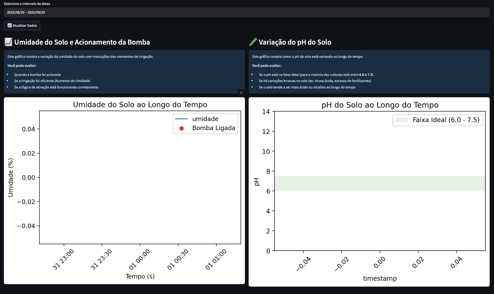
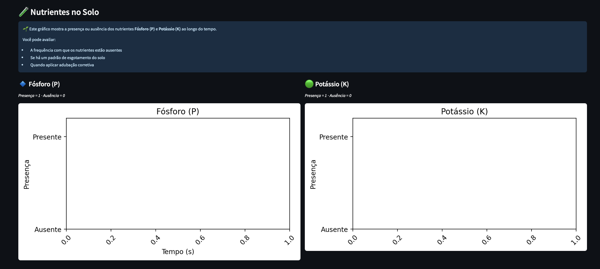
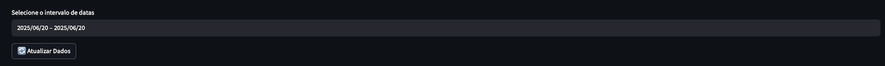
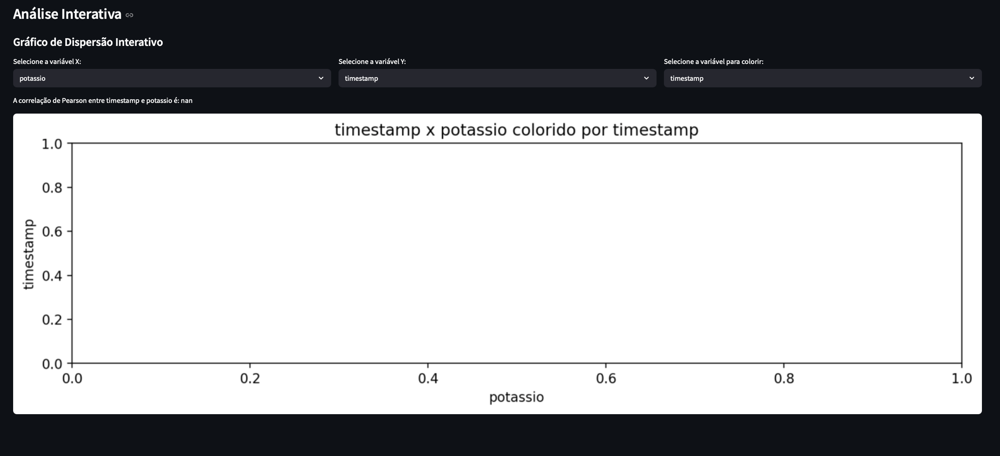
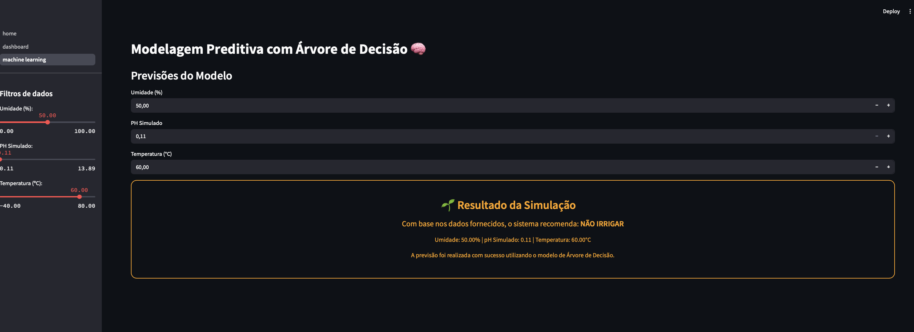
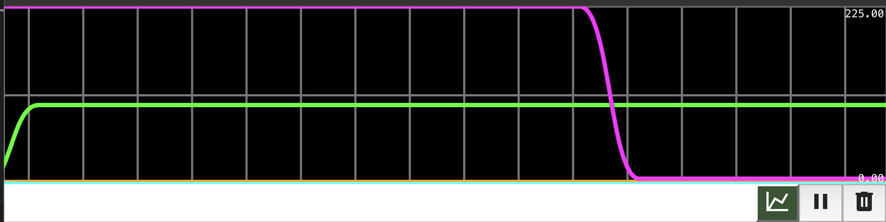

# FIAP - Faculdade de Informática e Administração Paulista

<p align="center">
  <a href="https://www.fiap.com.br/">
    
  </a>
</p>

## 👥 Grupo 21


## 👨‍🎓 Integrantes:

- Amanda Vieira Pires (RM565045)
- Ana Gabriela Soares Santos (RM565235)
- Bianca Nascimento de Santa Cruz Oliveira (RM561390)
- Milena Pereira dos Santos Silva (RM565464)
- Nayana Mehta Miazaki (RM565045)

## 👩‍🏫 Professores:

### Tutor(a)

- Lucas Gomes Moreira

### Coordenador(a)

- André Godoi

---

# 🌿 Sistema de Irrigação Inteligente com ESP32

### 🎥 Assista à demonstração no YouTube

[](https://youtu.be/kO4M81SsNnA)


## 📘 Descrição Geral

Este projeto faz parte de uma solução integrada de **irrigação inteligente com ESP32**, desenvolvida como atividade prática no curso de Inteligência Artificial da FIAP. Seu principal objetivo é aplicar conceitos de **automação agrícola**, **monitoramento ambiental**, **programação embarcada** e **persistência de dados**, simulando um cenário real de controle e otimização do uso da água em plantações.

Esse projeto é uma extensão do projeto já desenvolvido no repositório[chap1-phase3-agricultural-machine](https://github.com/fiap-ia-2025/chap1-phase3-agricultural-machine), com objetivo de otimização.

As otimizações realizadas foram:

1. **Código C++ otimizado**  
   Foram realizadas várias otimizações no código C++ do projeto wokwi. Cada otimização realizada por ser identificada no código pelos comentários inseridos.

2. **Banco de dados aprimorado**  
   Entidades não utilizadas foram removidas e novas colunas adicionadas.

3. **Modelagem preditiva com Scikit-learn**
  Foi criada uma modelagem supervisionada utilizando algorítimos de classificação da biblioteca scikit-learn.

4. **Interface com Streamlit**
  Foram criadas interfaces para representar graficamente os dados inseridos na base de dados e criar uma interação com a modelagem preditiva.

4. **Integração do Serial Plotter**
  O Seal Plotter foi utilizado na silumação com wokwi para printar as informações coletadas dos sensores, assim como exibi-las graficamente.

5. **Inclusão do display LCD no Wokwi**
  Foi incluído um display LCD na simulação wokwi para exibir as informações coletadas diretamente no sistema físico.

<br>

Além dos tópicos abordados acima, o projeto também foi restruturado para se adequar ao template padrão de projetos.

Seguem abaixo mais detalhes sobre cada tópico evoluído no projeto.

<br>

## Código C++ otimizado

O código foi revisado para otimizar o uso de memória RAM no ESP32, garantindo maior eficiência e estabilidade. As principais otimizações realizadas foram:

- **Uso de tipos inteiros menores:**  
  - `interval` definido como `const uint16_t`, suficiente para intervalos de até 65 segundos.
  - `phRaw` definido como `int16_t`, pois o valor de `analogRead` vai de 0 a 4095.
- **Uso de `bool` para flags:**  
  - Variáveis como `phosphorusAbsent`, `potassiumAbsent` e `shouldIrrigate` usam o tipo `bool`, que ocupa apenas 1 byte.
- **Uso de `char` para status simples:**  
  - Status de nutrientes (`phosphorusStatus`, `potassiumStatus`) são representados por caracteres (`'A'` para ausente, `'P'` para presente), economizando memória em relação a strings.
- **Uso de `float` apenas onde necessário:**  
  - Mantido para cálculos de pH e umidade, pois sensores analógicos requerem precisão decimal.
- **Conversão para tipos menores na exibição:**  
  - Ao exibir a umidade no LCD, é feito cast para `uint8_t`, já que o valor está sempre entre 0 e 100.

Essas otimizações tornam o código mais eficiente, especialmente em aplicações embarcadas onde o uso de memória é crítico.

<br>

## Banco de dados aprimorado

O banco de dados foi modificado para manter apenas o que de fato está sendo utilizado no projeto e incluir informações relevantes, como:

* Remoção das tabelas **sensor_umidade**, **sensor_ph**, **sensor_p** e **sensor_k** pois não estavam sendo utlizadas no projeto, apenas eram criadas mas sem utilidade.

* Inclusão da coluna **temperatura** na tabela **leitura_sensor**, pois a temperatura é um dado importante e utilizado no simulação wokwi.

<br>

## Modelagem preditiva com Scikit-learn

A modelagem preditiva foi desenvolvida no arquivo `machine_learning.ipynb`, utilizando a biblioteca Scikit-learn para criar um modelo de classificação capaz de prever a necessidade de irrigação com base nos dados coletados pelos sensores.

### 1. Objetivo

O objetivo principal da modelagem é prever automaticamente se a bomba de irrigação deve ser acionada, considerando variáveis como umidade do solo, pH, presença de fósforo e potássio, além da temperatura.

### 2. Pipeline de Machine Learning

O processo de modelagem seguiu as seguintes etapas:

- **Coleta e preparação dos dados:**  
  Os dados foram extraídos da simulação wokwi e carregados em um DataFrame do Pandas. Foram selecionadas as colunas relevantes e tratados valores ausentes.

- **Engenharia de atributos:**  
  Variáveis categóricas (como presença de fósforo e potássio) foram convertidas para valores numéricos. A variável alvo foi definida como o status da bomba (`bomba`).

- **Divisão dos dados:**  
  Os dados foram divididos em conjuntos de treino e teste (80%/20%) para validação do modelo.

- **Treinamento do modelo:**  
  Foram testados diferentes algoritmos de classificação, como `RandomForestClassifier`, `DecisionTreeClassifier` e `LogisticRegression`. O modelo com melhor desempenho foi selecionado com base na acurácia.

- **Avaliação:**  
  O modelo foi avaliado utilizando métricas como acurácia. Os resultados mostraram boa capacidade de generalização para o problema proposto.

### 3. Resultados

O modelo apresentou alta acurácia na predição do acionamento da bomba, indicando que as variáveis coletadas são suficientes para automatizar a decisão de irrigação. Isso permite que o sistema recomende ou acione a irrigação de forma inteligente, reduzindo desperdícios e otimizando o uso da água.

O notebook completo com código, gráficos e análises está disponível no arquivo `machine_learning.ipynb`.

### 4. Exportação do Modelo com Joblib

Após treinar e avaliar o modelo de Decision Tree com boa acurácia, utilizamos a biblioteca `joblib` para exportar o modelo treinado. Isso permite reutilizar o modelo em outros scripts ou aplicações sem a necessidade de re-treinamento.

<br>

## Interface com Streamlit

A interface desenvolvida com **Streamlit** tem como objetivo proporcionar uma visualização clara, interativa e acessível dos dados coletados pelo sistema de irrigação inteligente. Ela permite que usuários acompanhem o desempenho do sistema, analisem tendências e tomem decisões informadas sobre a irrigação.

### Principais Funcionalidades

- **Dashboard Interativo:**  
  Exibe gráficos em tempo real com os dados armazenados no banco SQLite, facilitando a análise visual dos principais indicadores agrícolas.

- **Visualização de Umidade do Solo:**  
  Gráfico de linha mostrando a evolução da umidade ao longo do tempo, com marcação dos momentos em que a bomba de irrigação foi acionada.

- **Monitoramento do pH do Solo:**  
  Gráfico de linha com faixa indicativa do intervalo ideal de pH, permitindo identificar rapidamente desvios e necessidade de correção.

<p align="center">
  
</p>

- **Status dos Nutrientes (Fósforo e Potássio):**  
  Gráficos de barras binários (presente/ausente) para fósforo e potássio, facilitando o acompanhamento da disponibilidade desses nutrientes no solo.

<p align="center">
  
</p>

- **Filtros e Seleção de Período:**  
  Possibilidade de filtrar os dados por intervalo de datas, permitindo análises específicas por período.

<p align="center">
  
</p>

- **Resumo Estatístico:**  
  Exibe estatísticas resumidas, como médias, máximos e mínimos dos principais parâmetros monitorados.

<p align="center">
  
</p>


Além do dashboard de visualização, o projeto conta com uma interface Streamlit dedicada ao arquivo `machine_learning.py`, que permite ao usuário interagir diretamente com o modelo preditivo treinado.

### Funcionalidades da Interface

- **Previsão de Irrigação:**  
  O usuário pode inserir manualmente valores para umidade do solo, pH, temperatura, presença de fósforo e potássio. Com base nesses dados, a interface utiliza o modelo treinado para prever se a bomba de irrigação deve ser acionada.

- **Formulário Interativo:**  
  Campos deslizantes e seletores facilitam a entrada dos dados dos sensores, tornando o teste do modelo acessível mesmo para quem não tem experiência em programação.

- **Exibição do Resultado:**  
  Após o envio dos dados, a interface exibe de forma clara se a irrigação é recomendada ou não, com base na predição do modelo.

- **Explicação dos Parâmetros:**  
  A interface inclui descrições breves sobre cada parâmetro de entrada, ajudando o usuário a entender o impacto de cada variável na decisão do sistema.

<p align="center">
  
</p>

<br>

## Integração Serial Plotter

O projeto pode ser utilizado com o **Serial Plotter** do VS Code ou Arduino IDE para visualização gráfica em tempo real das principais variáveis do sistema, como umidade, pH e status da bomba de irrigação.

- Para usar o Serial Plotter, basta abrir o monitor serial no modo plotter após iniciar o projeto.
- Os dados enviados pelo código incluem informações de umidade, pH e status da bomba, permitindo acompanhar graficamente o comportamento do sistema ao longo do tempo.
- Cada variável pode ser visualizada em uma linha separada no gráfico, facilitando a análise e o ajuste dos parâmetros do sistema.

<br>



<br>

## Inclusão do display LCD no Wokwi

<p align="center">
  
</p>


O display LCD foi adicionado ao circuito simulado no Wokwi para proporcionar uma visualização em tempo real dos principais dados coletados pelo sistema embarcado. Com essa inclusão, é possível exibir diretamente no hardware simulado informações como umidade do solo, valor de pH, status da bomba de irrigação e presença de nutrientes (fósforo e potássio).

A integração do LCD permite:

- Monitorar rapidamente os valores dos sensores sem depender apenas do monitor serial.
- Facilitar a demonstração do funcionamento do sistema em apresentações ou testes práticos.
- Simular de forma mais fiel como seria a experiência do usuário em um dispositivo físico real.


No código C++, foram implementadas funções para atualizar o display LCD a cada nova leitura dos sensores, garantindo que os dados exibidos estejam sempre atualizados. O diagrama do circuito no Wokwi foi ajustado para incluir as conexões necessárias entre o ESP32 e o display LCD, conforme ilustrado na imagem acima.

## 📁 Estrutura do Projeto

```bash
/chap1-phase4-agricultural-machine
├── src/                                # Código fonte
│   ├── application/                    # Código fonte do CRUD
│   │   ├── db_operations.py            # Operações com o banco de dados
│   │   ├── db_setup.py                 # Setup do banco de dados
│   │   ├── farm_data.db                # Banco de dados SQLite
│   │   ├── main.py                     # Função main
│   │   └── weather_integration.py      # Integração com API de tempo
│   ├── streamlit/                      # Interfaces streamlit
│   │   ├── pages/                      # Subpáginas streamlit
│   │   │   ├──  dashboard.py           # Inteface dashboard
│   │   │   └──  machine_learning.py    # Interface previsão de machine learning
│   │   └── home.py                     # Interface padrão home
│   ├── wokwi/                          # Simulação wokwi
│   │   ├── src/                        # Código fonte simulação
│   │   │   └──  main.cpp               # Função main
│   │   ├── platformio.ini              # Configuração do PlatformIO
│   │   ├── driagram.json               # Configuração circuito
│   │   └── wokwi.toml                  # Configuração wokwi
├── assets/                             # Imagens utilizadas no README
│   ├── circuito_diagrama_antigo.png 
│   ├── circuito_diagrama.png          
│   ├── logo-fiap.png                   
│   ├── serial_plotter.png              
│   ├── streamlit_dash1.png             
│   ├── streamlit_dash2.png            
│   ├── streamlit_dash3.png             
│   ├── streamlit_dash4.png             
│   └── streamlit_machine_learning.png
├── documents/                          # Documentos utilizados
│   ├── coletas-dados-normalizados.csv  # Arquivo com dados coletados normalizados        
│   ├── coletas.csv                     # Arquivo com dados coletados brutos 
│   ├── decision_tree_model.pkl         # Modelo treinado extraído
│   ├── machine_learning.ipynb          # Modelagem preditiva 
│   └── sample_data.txt                 # Arquivo usado na pliacação python
├── .gitignore                          # Arquivos/pastas ignorados pelo Git
└── README.md                           # Documentação geral do projeto
```

<br>

## ▶️ Como Rodar o Projeto

### ✅ Requisitos

- [Visual Studio Code (VS Code)](https://code.visualstudio.com/)
- Extensões instaladas no VS Code:
  - **PlatformIO IDE** (ícone da formiguinha 🐜)
  - **Wokwi for VS Code** (ícone com `<>` da simulação)
  - **SQL Viewer**
- Git instalado na máquina (para clonar o repositório)
- As seguintes bibliotecas instaladas:
  ```bash
  pip install streamlit pandas matplotlib seaborn requests missingno sklearn joblib
  ```

---

## 🔧 Passo a Passo

### Parte 1 – Simulação do Hardware (ESP32 no Wokwi)

1. **Clone o repositório**

   - Abra o terminal
   - Execute o comando:

     ```bash
     git clone https://github.com/fiap-ia-2025/chap1-phase4-agricultural-machine.git
     ```

<br>

2. **Abra o VS Code e carregue apenas a pasta /src/wokwi como uma janela separada.**

- Não abra a pasta raiz do repositório. Clique em "Abrir Pasta" no VS Code e selecione diretamente `wokwi`.

<br>

3. **Compile o projeto com PlatformIO**

- No VS Code, clique no ícone da formiguinha 🐜 (PlatformIO) no menu lateral esquerdo
- Clique em **"Build"** para compilar o `main.cpp` (aguarde a conclusão)

<br>

4. **Execute a simulação com Wokwi**

- Pressione `Ctrl+Shift+P` (ou `Cmd+Shift+P` no Mac) para abrir a Command Palette
- Digite `>Wokwi: Start Simulation` e pressione Enter
- A simulação será aberta no navegador com o firmware já compilado

  > Obs: certifique-se de que o projeto foi compilado primeiro com o botão **Build** do PlatformIO.

<br>

5. **Acompanhe os dados no Monitor Serial**

- O monitor serial da simulação mostrará:

  - Umidade lida pelo DHT22
  - Valor de pH (simulado via LDR)
  - Presença/ausência de fósforo e potássio (botões)
  - Estado da bomba (ligada ou desligada)
  - Temperatura

  <br>

6. **Copie a linha gerada no monitor serial da simulação**

- A simulação exibe os valores da simulação. Copie os valores e gere uma linha igual a:

  ```bash
   P=Presente, K=Presente, Umidade=74.50%, pH=3.4, Bomba=0, Temperatura=30.0
  ```

  - Copie essa linha para usar na próxima etapa

  <br>

### Parte 2 – Sistema de CRUD e Visualização (Python)

7. **Abra outra janela do VS Code e carregue apenas a pasta `src`**


<br>

8. **Cole o dado simulado no arquivo `sample_data.txt`**

- Abra o arquivo `sample_data.txt` na pasta /documents
- Substitua ou adicione a linha copiada na simulação.

  - ⚠️ **Atenção:** apenas a **primeira linha** do arquivo (`linha 1`) será processada pelo sistema, mesmo que o arquivo contenha várias linhas

<br>

9. **Execute o sistema**

- No terminal do VS Code, na raiz do projeto, execute:

  ```bash
  python main.py
  ```

<br>

10. **Use o menu interativo para processar e manipular os dados:**

```bash
================================================================================
====================== Sistema de Monitoramento Agrícola =======================
================================================================================

1. Processar Dados de Leitura
2. Visualizar Leituras
3. Atualizar Leitura
4. Excluir Leitura
5. Estatísticas
6. Consultar Previsão do Tempo
0. Sair

Escolha uma opção:
```

- Escolha a opção 1 para processar os dados do `sample_data.txt` e inseri-los no banco SQLite.
- As demais opções permitem visualizar, editar e consultar os dados armazenados.

<br>

11. **Rodar o Dashboard Streamlit**

- Execute o comando:
  ```bash
  streamlit run home.py
  ```
- Após rodar acesse o dashboard no navegador pelo link: http://localhost:8501

<br>

## ✅ Conclusão

O projeto consolida a aplicação prática de tecnologias embarcadas, sensores, automação e ciência de dados para resolver um problema real da agricultura: **o uso eficiente e inteligente da água.** Ao combinar sensores físicos, lógica de controle, banco de dados e integração com fontes externas de informação, a solução oferece um modelo funcional de **agricultura de precisão** em nível educacional.

O desenvolvimento foi feito com foco em clareza, modularidade, boas práticas e documentação, refletindo tanto o aprendizado técnico quanto a capacidade de estruturar soluções completas em equipe.
